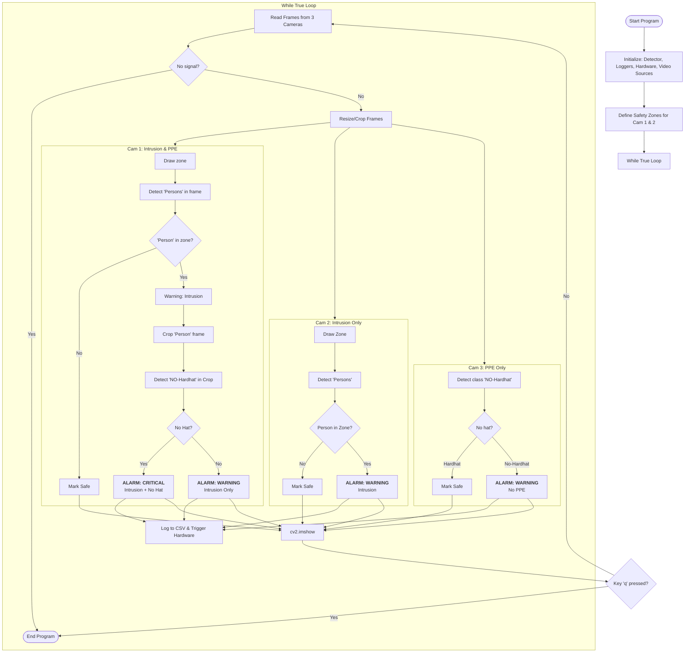

# Factory Safety Monitoring System

Dự án AI giám sát an toàn lao động tại nhà máy sử dụng 3 Camera với các chức năng chuyên biệt:
1. **Cam 1:** Giám sát xâm nhập Vùng nguy hiểm & Kiểm tra nón bảo hộ.
2. **Cam 2:** Giám sát xâm nhập Vùng nguy hiểm.
3. **Cam 3:** Kiểm tra tuân thủ đội nón bảo hộ.

Khi phát hiện vi phạm/nguy hiểm:
- Lưu lịch sử
- Kích hoạt cảnh báo (hiển thị, âm thanh, v.v.).
- Trong trường hợp xâm nhập khu vực nguy hiểm, cần giả lập hành động gửi tín hiệu điều khiển ra phần cứng

## 1. Cài đặt

Yêu cầu Python 3.8+

```bash
# Thư viện
pip install -r requirements.txt
```
Chuẩn bị model best.pt trong folder models/, videos để giả lập cameras trong folder data/videos/

Project này sử dụng:
- Model từ https://github.com/snehilsanyal/Construction-Site-Safety-PPE-Detection
- Python 3.12.2 và các phiên bản thư viện mới nhất

## 2. Thực thi
```bash
# Command used for MacOS
cd ./.../factory-safety-monitoring
python ./main.py
```

## 3. Giải thích
### src/
1. **[detector.py](src/detector.py)** với class SafetyDetector, lấy model thông qua YOLO, với 2 functions detect và detect_in_zone
2. **[utils.py](src/utils.py)** cài đặt màu sắc và class id tuỳ theo model; ghi lại dữ liệu bằng class Logger; giả lập phần cứng bằng class HardwareSimulator; và 1 hàm dùng để in văn bản cho vật được phát hiện.
3. **[zones.py](src/zones.py)** với class ZoneManager sử dụng để vẽ và kiểm tra vật thể xâm nhập vùng nguy hiểm

### main.py
Xem diagram bên dưới hoặc [hình ảnh](results/explain.png)

